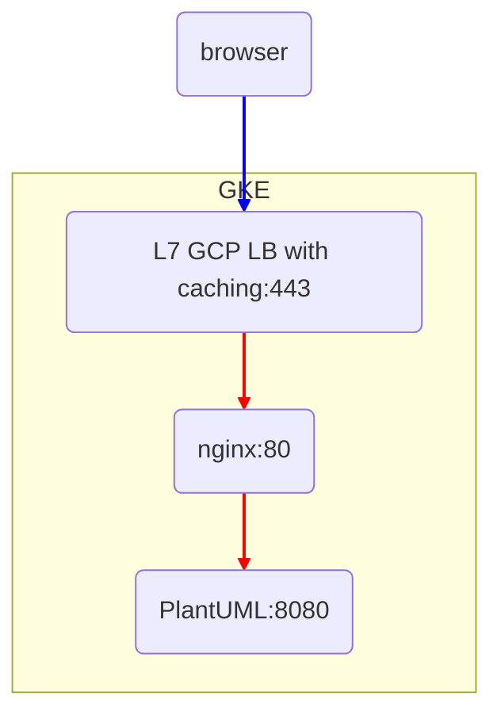

# PlantUML Helm Chart

PlantUML is a service that enabled UML diagrams. This Chart is maintained by
GitLab infrastructure team for the deployment of PlantUML in GKE on GCP.

## Configuration

PlantUML requires one secret `plantuml-cert` which is the SSL certificate
for the service that will be added to the L7 GCP load balancer.

Before installing the chart you must create this secret:

```
kubectl create secret tls plantuml-cert --cert certificate.chained.crt --key certificate.key -n <namespace>
```

The following table lists the configurable parameters of the PlantUML chart
and their default values.

| Parameter | Description | Default |
| --------- | ----------- | ------- |
| `image.tag` | Tagged version of PlantUML | `latest` |
| `nginx_sidecar.enabled` | Enables the nginx sidecar container | true |
| `nginx_sidecar.server_name` | Endpoint of the PlantUML server | `example.com` |
| `nginx_sidecar.redirect.enabled` | Enable a default redirect for a non-matching URL | true |
| `nginx_sidecar.redirect.url` | URL for a non-matching URL redirect | `redirect.example.com` |
| `nginx_sidecar.enabled_urls` | Enabled urls, by default `uml` and `proxy` are not enabled | `{png}` |
| `nginx_sidecar.limit_except.enabled` | Add `limit_except` rule to requests to limit request types | true |
| `nginx_sidecar.limit_except.req_methods` | Request types to allow | `{GET}` |
| `nginx_sidecar.hide_headers` | headers to remove from the response | _see values.yaml_ |
| `nginx_sidecar.add_headers` | headers to add to the response | _see values.yaml_ |

## PlantUML for GitLab integration

The overrides specified in [values.yaml](https://gitlab.com/gitlab-com/gl-infra/k8s-workloads/plantuml/blob/cf72fbd3d2a54faf2e94c543b709cc9d6e595267/values.yaml)
is used for GitLab.com PlantUML integration but could also be used for other
deployments for applications that integrate with PlantUML.

_Note: this section is specific to deploying on Google Cloud in GKE_



This configuration has the following features:

* GCP L7 load balancer for ingress, with CDN caching enabled
* Nginx sidecar enabled for header manipulation and rate limiting
* Limited PlantUML to the `/png` endpoint, disabling `/uml` and `/proxy`
* Adds a default redirect for all endpoints other than `/png`
